Durchführung
============

Für den mechanischen Zusammenbau gibt es im GitLab Repository eine `Bildergalerie`_ als Zip-File die man sich herunterladen kann. Die Bilder sind recht hilfreich und zeigen detailliert wie man vorgehen sollte. Nachfolgend ist eine Röntgenaufnahme zu sehen wie die internen Teile verbaut sind.

.. _Bildergalerie: https://gitlab.com/norbertwalter67/windsensor_yachta/-/archive/main/windsensor_yachta-main.zip?path=Pictures

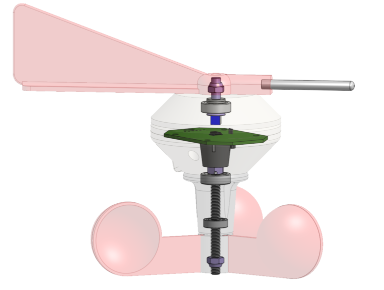

Abb.: Anordnung der inneren Teile im Windsensor Yachta

Wer eine detailliertere Ansicht haben möchte, kann sich beim `Online-CAD-Programm Onshape`_ kostenlos anmelden und im öffentlichen Repository nach **Yachta** suchen. Das gesamte Projekt kann in den eigenen Workspace kopiert werden und dort von allen Seiten betrachtet werden. Bauteile können angeklickt werden und über die rechte Maustaste lassen sich die Bauteile transparent schalten. Wer den Windsensor nach seinen eigenen Wünschen verändern möchte, kann das in Onshape selber machen. Über den Export mit STL können Dateien exportiert werden die ein Slicer für einen 3D-Drucker aufbereiten kann.

.. _Online-CAD-Programm Onshape: https://cad.onshape.com/

Lackierung
----------

PETG ist ein Kunststoff der sich aufgrund seiner Oberflächeneigenschaften nicht direkt lackieren läßt. Es muss eine spezielle Vorbehandlung des Untergrundes erfolgen. Es gibt aber Speziallacke die ohne Grundierung und Vorbehandlung direkt auf PETG aufgetragen werden können. Der empfohlene transparente Lack „Aerosol Art“ von Dupli-Color (matt oder glänzend) ist ein Polymerlack mit Aceton und n-Butylacetat in einer 400ml Sprühdose. Er kann direkt auf PETG in mehreren Lagen ohne Abtrockenzeit aufgebracht werden.

Das Lackieren kann auf zweierlei Art vorgenommen werden. Entweder per Lackierung mit dem Pinsel oder per Sprühdose. Grundsätzlich sollten mit jedem Verfahren 3 Schichten aufgetragen werden. An den Passungen ist entsprechend dünner aufzutragen. Grundsätzlich sollte der Schichtaufbau dünn sein und keine Laufnasen aufweisen. Laufnasen sind im feuchten Zustand zu entfernen.

Das Sprühlackieren sollte möglichst im Freien erfolgen, da mehr Lack daneben gesprüht wird als auf das Bauteil kommt. Im Hintergrund sollte eine Pappe aufgestellt werden die den überschüssigen Lack aufnimmt. Je nach Empfehlung des Lackherstellers sollte ein Mindestanstand von 30cm beim Lackieren zum Bauteil eingehalten werden. Anderenfalls trägt man sonst zu viel Lack auf und es kommt zu Läufern. Die `Teile werden beim Sprühen fortlaufend langsam gedreht`_ bzw. bewegt, so dass alle Flächen erreicht werden können. Das Lackieren der Schaleninnenseite ist etwas schwieriger, da man nicht richtig einsehen kann wie viel Lack aufgetragen ist. Hier sollte man zurückhaltender sein, da man eher neigt zu viel aufzutragen. Die richtige Schichtdicke ist erreicht, wenn der feuchte Lack anfängt zu glänzen.

.. _Teile werden beim Sprühen fortlaufend langsam gedreht: https://www.youtube.com/watch?v=OE7hlpwVKak

Der Lack ist nach kurzer Zeit handtrocken und nach 24h endgültig trocken.

Schalenrad
----------

Die Schalen können am besten von unten in die Basis geschoben werden. Um es vollständig hineinzubekommen, kann es notwendig sein, für die letzten Millimeter, einen Hammer zu benutzen. Hierbei muss nur aufgepasst werden, dass man die Schalen dabei nicht abbricht.
In die Aussparung im unteren Teil der Basis kommt die M5 Mutter hinein. Um ein Herausfallen während der Montage zu verhindern, kann die Mutter mit einem Tropfen Sekundenkleber in der Aussparung befestigt werden.

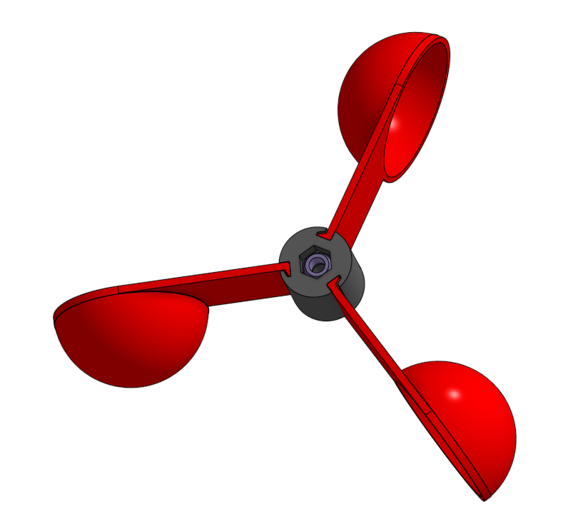

Abb.: Yachta Schalenrad

Magnethalter und unteres Lager
------------------------------

Das 695 Kugellager wird von unten und das 625 Kugellager von oben bis zur jeweiligen Kante in das Unterteil des Windsensors eingefügt.

.. list-table::
   :widths: 50 50
   :class: borderless

   * - .. image:: ../pics/Ball_Bearing_Button.png
          :scale: 30%
     - .. image:: ../pics/Ball_Bearing_Middle.png
          :scale: 30%

Abb.: Unterteil des Yachtasensors mit Kugellagern

Die Magnete können relativ einfach mit Sekundenkleber im Magnethalter festgeklebt werden.Beim Einbau der Magnete ist auf richtige Polarität zu achten.

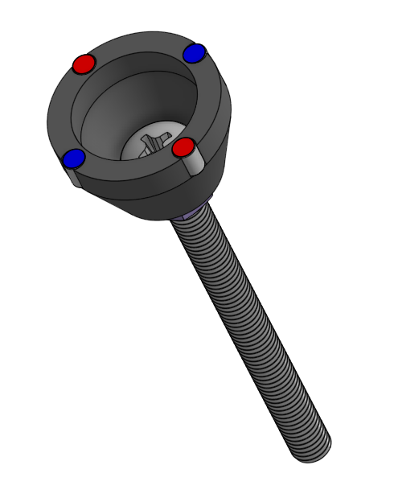

Abb.: Magnethalter mit Magneten

Um die Montage zu vereinfachen, kann man in die Innenseite des Magnethalter vorübergehend Klebeband kleben und die Magnete dann von außen in die Aussparungen drücken. Das Klebeband kann, sobald der Sekundenkleber getrocknet ist, wieder entfernt werden. Darauf kann die M5 x 60 mm Schraube durch den Magnethalter geführt und von unten mit einer Mutter befestigt werden. Der Halter kann anschließend durch das Unterteil gesteckt werden.

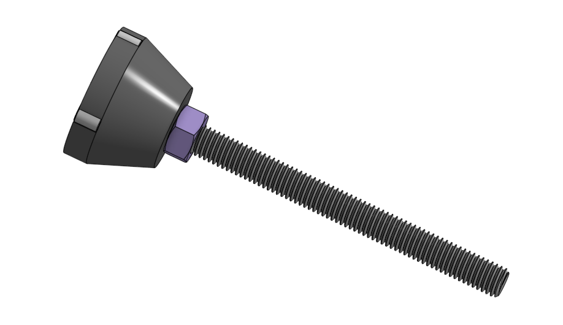

Abb.: Magnethalter mit Kontermutter
   
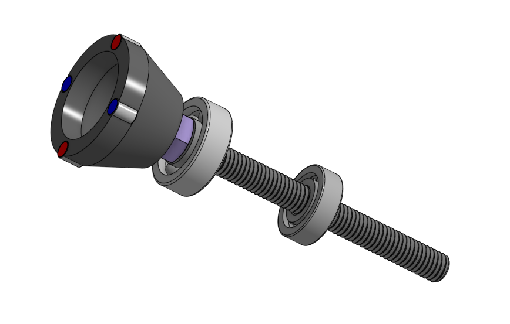

Abb.: Magnethalter mit Kugellagern
   
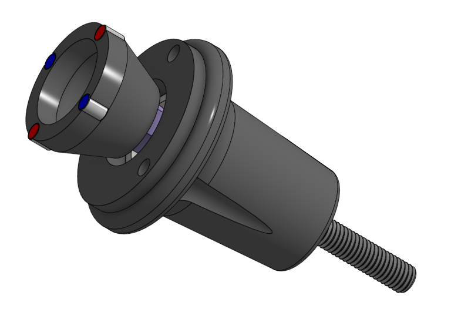

Abb.: Magnethalter und Unterteil des Yachtasensors

Im letzten Schritt muss nur noch das Schalenrad angeschraubt werden. Hierbei sollte man darauf achten das Ganze nicht zu festzuschrauben, damit sich das Schalenrad leicht drehen kann. Wenn die gewünschte Leichtläufigkeit erreicht ist, kann die Schraube an der unteren Mutter noch mit Loctite gesichert werden.

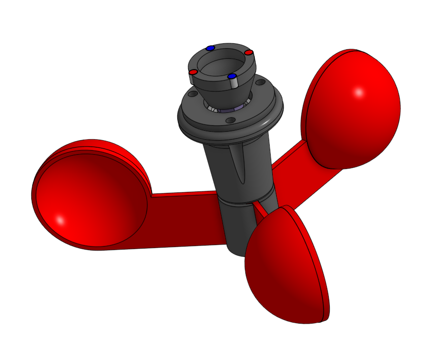

Abb.: Kompletter Unterbau des Yachtasensors

Windfahne und Unterbau
----------------------

Der Unterbau der Windfahne besteht aus einem Ober- und einem Unterteil. In die Oberseite des Unterteils wird das 625 Kugellager eingesetzt, die M5 x 25 Senkkopfschraube von unten durchgesteckt und mit einer Mutter gesichert. Auch an dieser Stelle ist darauf zu achten, dass die festgeklemmte Schraube sich leichtläufig drehen kann. Anschließend wird das Oberteil mit vier M3 x 10 Schraube auf das Unterteil geschraubt, um das Kugellager an Ort und Stelle zu halten.

.. list-table::
   :widths: 50 50
   :class: borderless

   * - .. image:: ../pics/Top1_Bearings.png
          :scale: 30%
     - .. image:: ../pics/Top1_Top2_Bearings.png
          :scale: 30%

Abb.: Windfahnenbasis des Yachtasensors

Im nächsten Schritt wird eine M5 Mutter in die Aussparung der Windfahne gesteckt und kann dort zusätzlich mit Kleber fixiert werden.

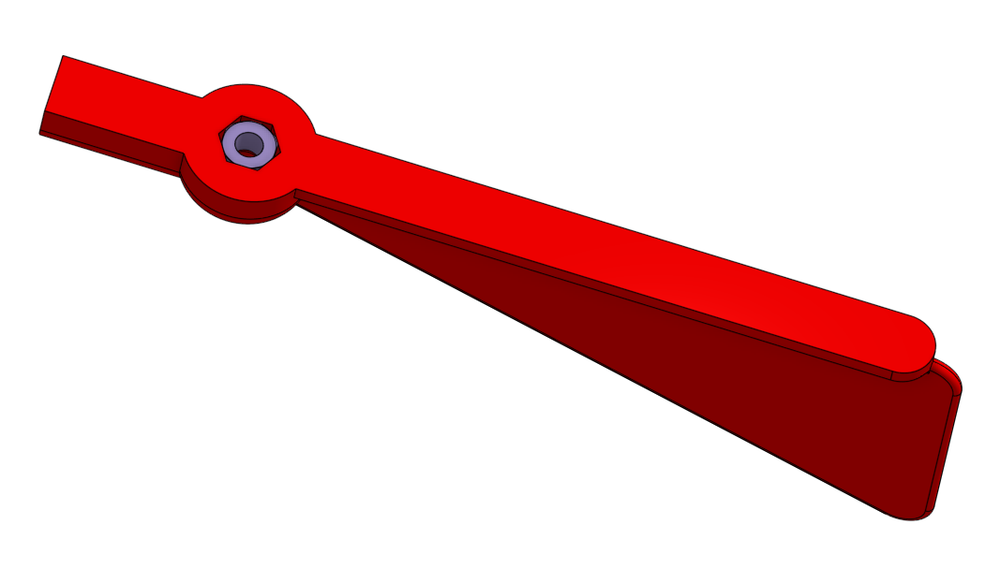

Abb.: Windfahne des Yachtasensors

Die Basis der Windfahne kann jetzt auf den bereits monierten Unterbau gesteckt und anschließend mit der Windfahne fixiert werden.

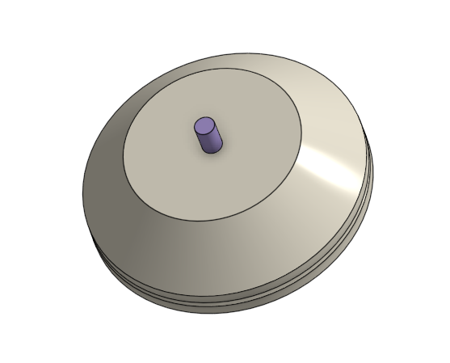

Abb.: Windfahne des Yachtasensors

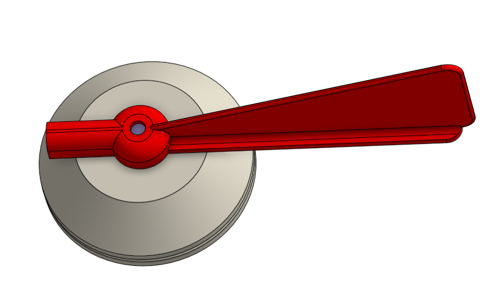

Abb.: Windfahne von oben

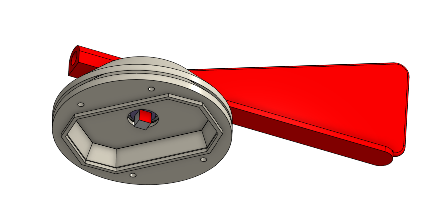

Abb.: Windfahne von unten

Als nächtes muss noch der 5 x 5 x 5 mm Magnet auf die Senkkopfschraube geklebt werden. Hier ist ebenfalls auf die korrekte Ausrichtung des Magneten zu achten. Die äußeren Kanten des Magneten sollten parallel zur Windfahne ausgerichtet werden. Sollte trotzdem noch ein Ausrichtungsfehler vorliegen, so kann er über einen Offset unter Device Settings korrigiert werden. Zum Abschluss kann die Spitze angebracht werden.

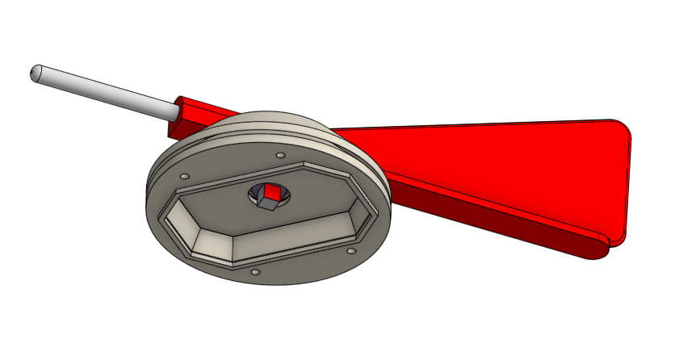

Abb.: Windfahne mit Magnet und Spitze

Standrohr und Basis
-------------------

Das Alurohr wird in die Basis des Sensors geschoben und kann dann an Ort und Stelle mit einem Loch für die Kabel versehen werden. Anschließend kann die Platine mit den bereits angelöteten Kabeln für die Stromversorgung in die vorgesehene Aussparung eingelegt werden.  Hierfür müssen die Kabel vorher ins Alurohr geführt werden. Ist alles am richtigen Platz, kann die Platine mit vier M3x10 Schrauben befestigt werden.

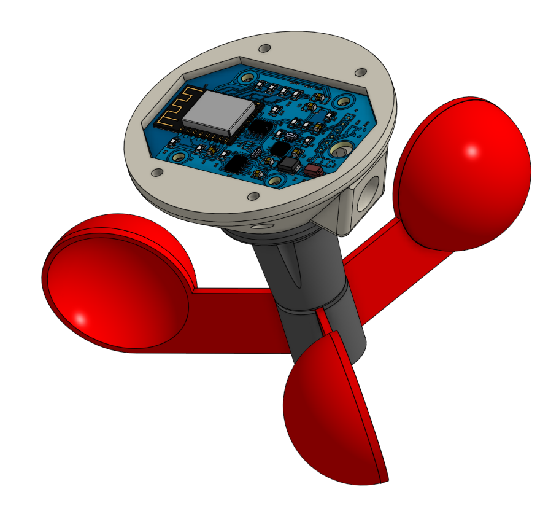

Abb.: Platine in Basis

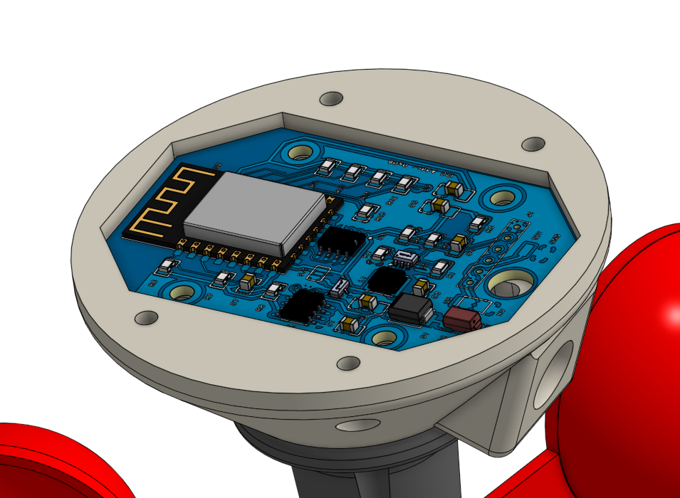

Abb.: Platine in Basis

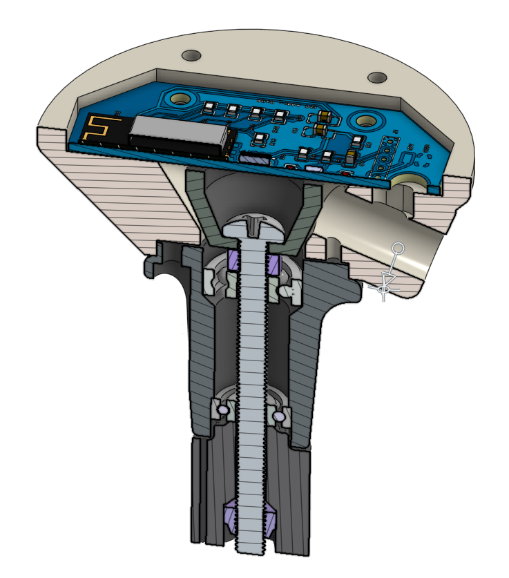

Abb.: Schnittansicht der Basis

Software
--------

Die Software ist in C mit der Arduino IDE programmiert worden. Die Firmware selbst zu compilieren erfordert Erfahrung im Umgang mit der Arduino IDE und dem installieren der benötigten Software-Bibliotheken in der richtigen Version. Aufgrund der hohen Komplexität wurde die Firmware schon kompiliert und als Binärdatei dem Nutzer zur Verfügung gestellt. So erspart man sich den ganzen Aufwand die Firmware selbst zu kompilieren.

Firmware Installation
---------------------

Die Installation der Firmware auf dem ESP12-E kann vor dem Einlöten mit einem Programmieradapter oder auch auf der fertig bestückten Platine erfolgen.

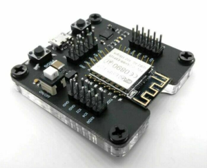
   
Abb: ESP8266 Programmieradapter für externe Programmierung

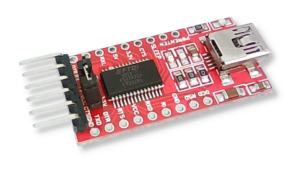
   
Abb: Programmieradapter für Programmierung auf der Platine

Bei Verwendung eines Programmieradapters für die Programmierung auf der Platine ist darauf zu achten, dass die Signalpegel für TX und RX 3.3V TTL-Pegel unterstützen. 5.0V TTL-Pegel können nicht genutzt werden, da der ESP12-E damit beschädigt werden kann. Der Programmieradapter ist wie im Bild dargestellt anzuschließen. Man muss darauf achten, dass RX mit TX und TX mit RX verbunden sind. Anderenfalls kann man sonst keine Programmübertragung durchführen.

.. image:: ../pics/SProgrammierschaltung_Yachta.png
   :scale: 50%

Abb: Programmierschaltung

**Programmieranleitung**

    1. Programmierschaltung zusammen bauen
    2. PRG und GND verbinden
    3. Programmieradapter USB mit Laptop oder PC verbinden
    4. 9V Batterieblock zuschalten
    5. Programmiersoftware NodeMCU Flasher auf Laptop oder PC starten und Firmware laden
    6. Programmiervorgang starten
    7. Bei erfolgreicher Programmierung USB trennen und 9V ausschalten
    8. PRG und GND trennen
    9. Programmierschaltung von Platine trennen
    10. 12V einschalten und Firmware über WiFi-Verbindung prüfen

**NodeMCU Flasher**

Als Programmiersoftware für den ESP12-E kann das einfach zu benutzende Windows Tool NodeMCU Flasher verwendet werden. Die EXE-Datei kann ohne spezielle Installation direkt gestartet werden. Das Tool kann sowohl für die externe als auch für die Programmierung in der Schaltung verwendet werden. Als erstes werden unter Advanced folgende Einstellungen vorgenommen.

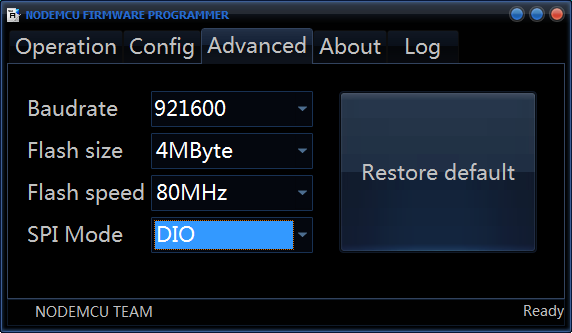

Danach wird unter Config die aktuelle Firmwaredatei firmware_Vx.xx.wsb ausgewählt.

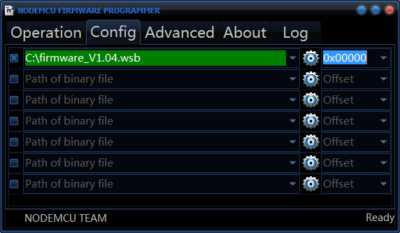

Zum Flashen geht man auf Operation und wählt die entsprechende Schnittstelle aus an der der Adapter angeschlossen ist. Danach drückt man auf Flash und wartet ab, bis die Firmware geladen ist.

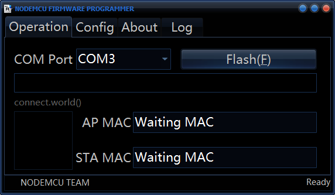

Während des Flashens wird der Fortschritt der Übertragung angezeigt.

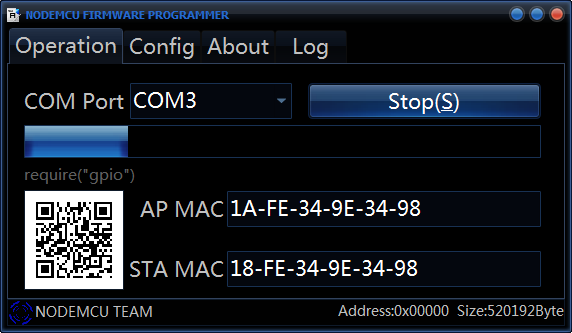

Wenn die Firmware erfolgreich geladen wurde, ist folgender Bildschirm zu sehen.

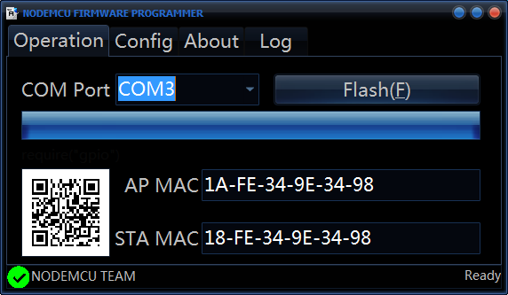

Nach der Übertragung kann das Programmiertool geschlossen und der Adapter abgezogen werden.

Um die neue Firmware zu starten, benötigt der Windsensor einen Reboot. Nach dem Neustart stellt  der Windsensor ein WiFi-Netzwerk mit dem Namen Yachta zur Verfügung, in das man sich 30 s nach dem Neustart mit einem Handy und dem Passwort 12345678 einloggen kann. Die blaue LED geht dann 3x kurz aus, wenn der Webserver bereit ist.  Ruft man dann die Webseite des Windsensors mit der Android App auf (http://192.168.5.1), sollte Folgendes zu sehen sein. Werden unter WLAN Client SSID und WLAN Client Password Zugangsdaten von einen AccessPoint eingeben, so bucht sich der Windsensor in dieses WiFi Netzwerk ein. Die blaue LED verlischt dann als Hinweis für eine erfolgreiche Verbindung. Werden Messdaten über Port 6666 von einem Programm wie z.B. OpenCPN oder ähnlichen abgerufen, blinkt die blaue LED immer kurz auf, wenn ein Telegramm übertragen wird.

.. list-table::
   :widths: 50 50
   :class: borderless

   * - .. image:: ../pics/AppStart-169x300.png
          :scale: 30%
     - .. image:: ../pics/AppInstrument1-169x300.png
          :scale: 30%
	 - .. image:: ../pics/AppInstrument2-169x300.png
          :scale: 30%	  

Als letztes muss in der Firmware noch der richtige Windsensor-Typ Yachta in der Konfiguration ausgewählt werden, damit die Daten korrekt angezeigt werden.

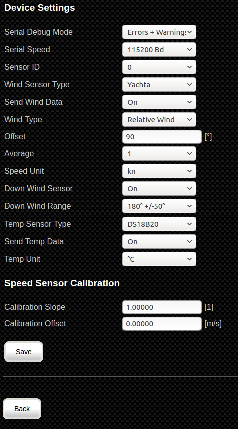

Abb: Device Settings für Yachta

.. list-table::
   :widths: 50 50
   :class: borderless

   * - .. image:: ../pics/Yachta2-290x300.png
          :scale: 30%
     - .. image:: ../pics/Yachta_1-230x300.png
          :scale: 30%

Abb: Messwerte für Yachta