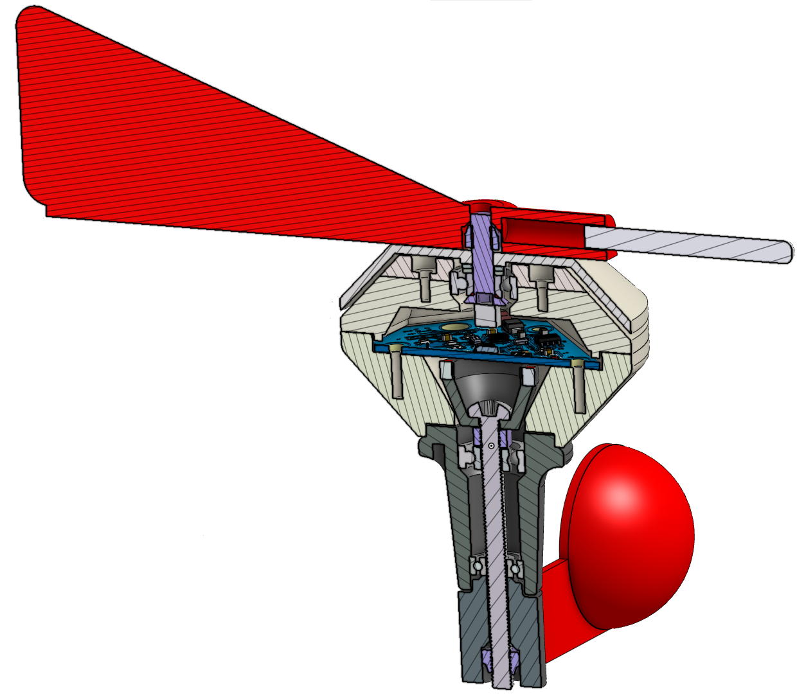
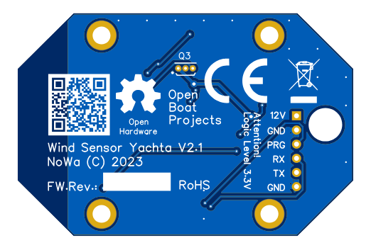
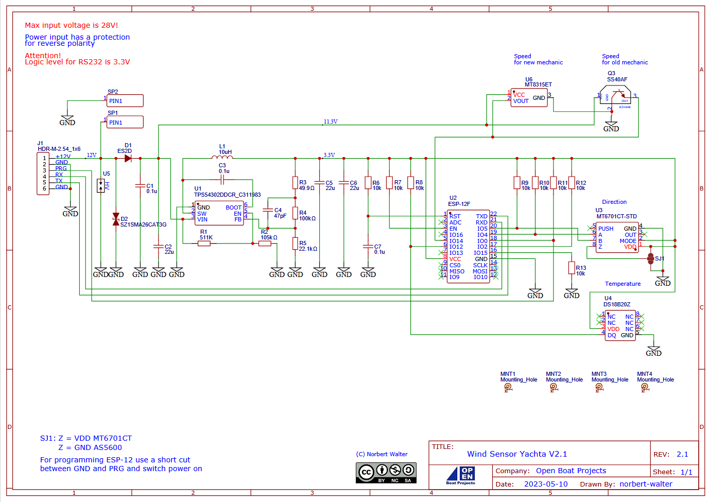

Geräteaufbau
============

Mechanischer Aufbau
-------------------

Abb.: Komponentenansicht

In der oberen Abbildung ist der Aufbau des Windsensor Yachta zu sehen. Das Gerät besteht aus einzelnen Komponenten, die im folgenden beschrieben werden.

	* **Windfahne mit Spitze und Abdeckung**
		Die Windfahne mit Spitze dient zur Richtungsmessung und Anzeige des Windes. Die Senkkopfschraube mit einem Würfelmagnet ist starr mit der Windfahne und der Abdeckung verbunden und wird durch ein Kugellager drehbar in den oberen beiden Gehäuseschalen gehalten. Die Abdeckung verhindert das indrigen von Spritzwasser. Die Spitze ist über ein Wewinde mit der Windfahne verbunden. Durch herein- und herausdrehen der Spitze ist die Balance der Windfahne einstellbar. Der Magnet an der Senkkopfschraube überträgt die Windrichtung berührungslos zum Drehrichtungssenso, der sich mittig auf der darunter liegenden Platine befindet.
	* **Obere Gehäuseschalen**
		Die oberen beiden Gehäuseschalen sind starr miteinander mit Schrauben verbunden und fixieren das obere Kugellager für die drehbare Windfahne.
	* **Untere Gehäuseschale**
		Die untere Gehäuseschale ist das zentrale Elemennt an dem alle anderen Teile befestigt werden. Die Unterschale hat ein Loch für den Befestigungsstab mit dem der Windsensor am Mast des Bootes befstigt wird. In der Unterschale befindet sich auch das Mainbord. 
	* **Mainboard**
		Das Mainboard enthält alle elektronischen Komponenten.
	* **Magnetkranz mit Schalenrad und Unterteil mit Kugellagern**
		Der Magnetkranz mit Schalenrad und das Unterteil mit Kugellagern bilden eine Einheit zur Messung der Windgeschwindigkeit. Der magnetkranz enthält vier Magnete mit wechselnder Polarität. Das Magnetfeld der Magnete durchdringt die Platine des Mainbords und löst den Hallsensor auf der Oberseite der Platine aus, wenn sich ein Magnet am Hallsensor vorbeidreht. Die Magnetfelder der Windgeschwindigkeit und der Windrichtung sind so ausgelegt, dass sie sich nicht gegenseitig beeinflussen. Der Magnetkranz ist starr mit dem Schalenrad verbunden und die Drehbewegung überträgt sich auf damit auf den Magnetkranz. Die lange Welle in Form einer Schraube wird mit zwei Kugellagern im unteren Schaft gehalten, der starr mit der Unterschale verbunden ist.
	* **Halterohr**
		Das Halterohr verbindet den Windsensor miot dem Befestigungsfuß. Im Halterohr werden auch die Kabel für die Stromversorgung durchgeführt.
	* **Befestigungsfuß**
		Mit dem befestigungsfuß wird der Windsensor am Mast befestigt. An ihm treten die höchsten Kräfte auf und er muss entsprechend stabil konstruiert sein.
	
		
Main Board
----------

Das Mainboard enthält alle elektrischen und elektronischen Komponenten wie:

	* DC/DC Wandler 12V auf 3.3V
	* Verpolungsschutz und Überspannungsschutz
	* Rotationssensor für Windrichtungsmessung
	* Hall-Sensor für Windgeschwindigkeit
	* Mikrocontroller zur Messdatenauswertung und Datenübertrgung

Abb.: Mainboard Oberseite

Platinen
--------

Die Platinen für das Mainboard und die Hintergrundbeleuchtung wurden als zweiseitig bestückte SMD-Platine mit Durchkontaktierungen, Stopplack, Bedruckung und vergoldeten Kontaktflächen ausgeführt.

.. image:: ../pics/PCB_Yachta_V2.1_Top.png
   :scale: 70%
Abb.: Unbestückte Platinen-Oberseite

Abb.: Unbestückte Platinen-Unterseite

Schaltplan und Fertigungsdaten
------------------------------

Der Schaltplan und die Platine wurden mit dem Online-Entwicklungstool EasyEDA erstellt. Nachfolgend sind die Unterlagen für eine Fertigung aufgeführt.

* `Schaltplan V2.1 [PDF] <../_static/files/Schematic_Windsensor-Yachta-Final-2.1_2025-07-21.pdf>`_
* `Bauteilliste [CSV] <../_static/files/BOM_Windsensor-Yachta-Final-2.1_2025-09-18.csv>`_
* `Bestückung [HTML] <../_static/files/ibom_yachta_v2.1.html>`_
* `3D-Daten der Kunststoff-Teile [ZIP] <../_static/files/OBP60_3D_Parts_V2.1.zip>`_

.. image:: ../pics/Lizenz_by-nc-sa_eu.png
   :scale: 45%

Die Fertigungsdaten von Schaltplan, Gerber-Daten und Bauteilliste und die 3D-Daten unterliegen der `Common Creative Lizenz (CC) BY BC SA 4.0`_. Das OBP60 darf unter Nennung der Urheber nachgebaut oder modifiziert werden. Es entstehen keinerlei Kosten für eine private Nutzung ohne kommerzielle Absichten. Eine kommerzielle Verwertung wird durch die Lizenz ausgeschlossen. Abgeleitete Werke unterliegen der selben Lizenz. Wenn Sie eine kommerzielle Nutzung des OBP60 beabsichtigen, kontaktieren Sie uns über das `Kontaktformular`_. Es besteht die Möglichkeit, ein nicht exklusives Nutzungsrecht über eine kommerzielle Lizenz zu erwerben.

.. _Common Creative Lizenz (CC) BY BC SA 4.0: https://creativecommons.org/licenses/by-nc-sa/4.0/legalcode.de
.. _Kontaktformular: https://open-boat-projects.org/de/kontakt

Schaltungsbeschreibung
----------------------

Abb.: Schaltplan Yachta V2.1

Am Kontaktfeld J1 liegen alle notwendigen Signale zum betrieb des Windsensors an. Das sind die Eingänge für die Versorgungsspannung (+12V, GND) als auch die Anschlüsse für die Programmierung des Mikrocontrollers (PRG) als auch die Signale zur Datenübertragung (RX, TX).

.. danger::
	Beachten Sie, dass die Signale PRG, RX und TX nur mit 3.3V TTL-Pegeln betreiebn werden dürfen. Benutzen Sie entsprechende Pegelkonverter, wenn sie andere Signalpegel verwenden. Kommen die Kontakte mit 12V in Verbindung, so wird der Mikrocontroller U2 zerstört. Achten Sie darauf, dass keine leitenden Gegenstände auf die Platine fallen oder sich unter der Leiterplatte befinden. Insbesomndere bei der Verwendung von Litzen können schnell einzelne Adern abbrechen und herunterfallen.

Die Bauelemente U5 und D2 schützen die Schaltung vor Überspannung und D1 dient als Verpolungsschutz	der Betriebsspannung. Die nachfolgenden Bauelemente von C1 über U1 bis zu C6 bilden den DC/DC-Wandler. Er wandelt die Eingangsspannung von 7...25V DC ind eine Ausgangsspannung von 3.3V. Diese Spannung versorgt die ICs U2, U3 und U4. U2 ist der Mikrocontroller ESP8266. Am Eingang IO14 liegt ein digitales Pulssignal an, mit dem die Windgeschwindigkeit gemessen wird. Das Pulssignal wird vom Hall-Sensor U6 oder alternativ vom Hallsensor Q3 bereitgestellt.

.. tip::
	Wer einen älteren Yachta-Windsensor-Aufbau mit kleinen Magneten im Magnetkranz benutzt, kann alternativ Q3 anstatt U6 verwenden. Dazu ist ein entsprechender Hallsensor an Position Q3 einzulöten.

Die Ausgaänge der Hall-Sensoren sind Low-aktiv und werden über einen internen Pullup-Widerstand im Mikrocontroller U2 mit 3.3V versorgt. Der Drehrichtungssensor U3 ist über IO4 und IO5 über den I2C-Bus mit dem Mikrocontroller U3 verbunden. R9 und R10 sind Pullup-Widerstände zur Signalformung. Über den Lötjumper SJ1 lässt sich auswählen welcher Sensortyp für U3 verwendet wird. Standardmäßig wird ein MT6701CT verwendet. Es wird dann eine Lötbrücke zwischen dem oberen und mittleren Anschluß benötigt. Als Alternative kann ein AS5600 verwendet werden. Dann muss sich die Lötbrücke zwischen dem mittleren und unteren Anschluß befinden. Der Temperatursensor U2 in Form eines DS18B20 ist über den 1Wire-Bus an IO12 mit dem Mikrocontroller verbunden.