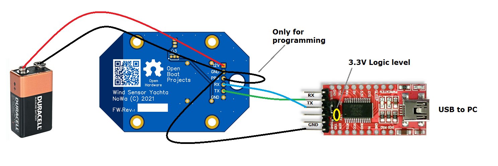

Funktionstests
==============

Der Funktionstest beschränkt sich darauf zu prüfen, ob die Sensoren korrekte Signale abgeben. Dazu eignet sich die Instrumentenansicht  am besten. Detailliertere Informationen zu den Sensorsignalen sind unter **Device Informations** zu finden.

Sie können die selbe Schaltung wie bei der Programmierung verwenden, brücken jedoch nicht PRG und GND.

Abb: Programmierschaltung

**Vorgehensweise**

    1. 9V Blockbatterie an 12V und GND anschließen
    2. Einloggen in das WiFi-Netzwerk **Yachta** mit dem Passwort **12345678**
    3. Webseite unter http://192.168.5.1 aufrufen
    4. Seite **Devive Informations** anwählen
    5. Spededsensor prüfen
		* Schmalen Stabmagnet D3x3 mm verwenden und an den Sensor U6 annähern
		* Sensorwert **Sensor 1 (Speed)* muss dann von 0 auf 1 springen
		* Reagiert der Sensor nicht, dann den Stabmagnet umdrehen und erneut testen
    6. Richtungssensor prüfen
		* Würfelmagnet N-S ausrichten und über den Sensor U6 halten und bewegen
		* Sensorwert **Dind Direction** muss sich entsprechend der Magnetausrichtung ändern
		* Reagiert der Sensor nicht, dann die Ausrichtung des Würfelmagnet prüfen und erneut testen
    7. Nach erfolgreichen Test Sensor zusammenbauen
    8. Finaltest durchführen und Sensorwerte prüfen
    9. Offset für Richtungssensor einstellen
		* Seite **Device Settings** aufrufen
		* Wert **Offset** so anpassen, dass bei Gerade-Aus-Orinetierung der Richtungswert 0° angezeigt wird

.. list-table::
   :widths: 50 50
   :class: borderless

   * - .. image:: ../pics/Yachta2-290x300.png
          :scale: 100%
     - .. image:: ../pics/Yachta_1-230x300.png
          :scale: 100%

Abb: Messwerte für Yachta

.. image:: ../pics/Yachta3.png
   :scale: 80%

Abb: Device Settings für Yachta