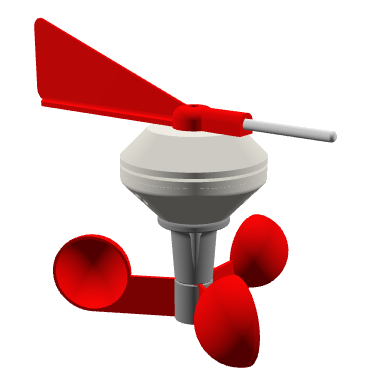
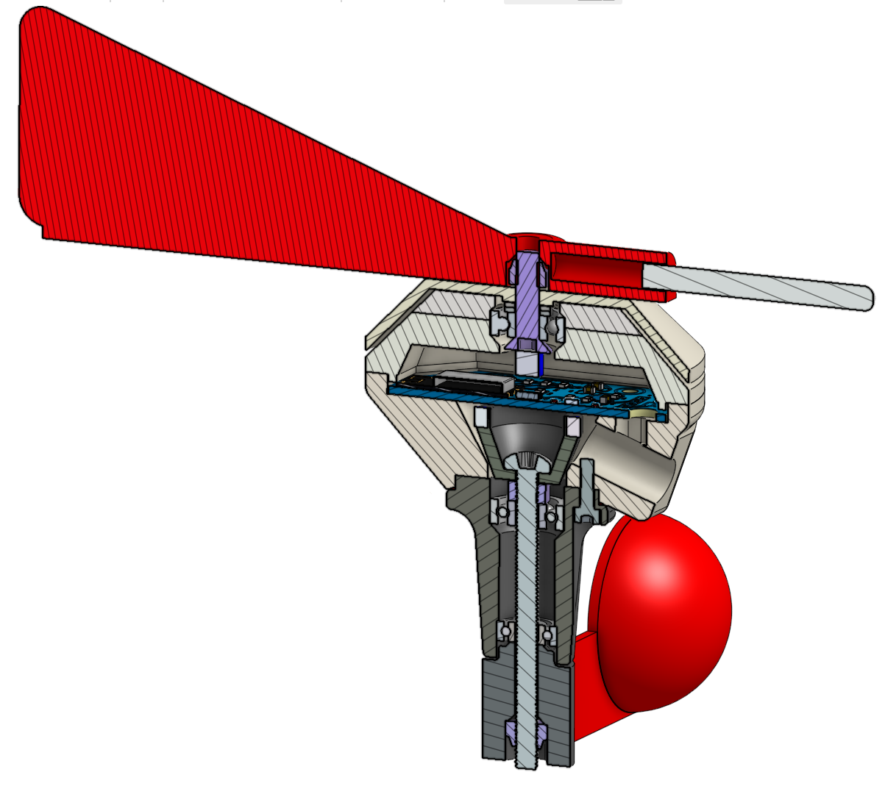
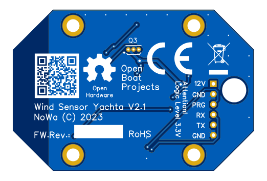

Technische Daten
================

Funktionen
----------

* Windspeed: 0…75 kn
* Windrichtung: 0…360°
* Winkelauflösung: 0,1°
* Integrierter Temperatursensor: -25...100 °C
* Mechanisches Funktionsprinzip
* Verschleißfreien berührungslose magnetische Sensorik
* Robuste Mechanik (3 Kugellager)
* Versorgungsspannung 7...25V / 0,36 W
* 12V Versorgung über Toplicht möglich
* Wetterfest und UV-stabil
* Keine Spezialteile aus Metall erforderlich
* Keine Kabel für Sensorsignale notwendig
* Signalübertragung per WiFi über NMEA0183
* TCP-Server Port: 6666
* JSON Datenausgabe
* Aktualisierungsrate: 1 Messwert pro Sekunde
* Kein Einbauinstrument notwendig
* Visualisierung auf einem  Laptop, Handy oder Tablett
* Webinterface zur Bedienung
* Passwortgeschützte Konfiguration
* Keine Extrasoftware notwendig (Web-Browser ist ausreichend)
* Firmware-Update via Internet möglich
* Datenübertragung zu AvNav, OpenCPN, SignalK, OpenPlotter und Navionics möglich
* Windsensor kann auch stationär als Wetterstation benutzt werden
* Anzeige der Winddaten über NASA Wind Tochterdisplay

Aufbau
------

Spezifikation
-------------

+----------------------+-----------------------------+
| Versorgungsspannung  | 7...25 V                    |
+----------------------+-----------------------------+
| Stromverbrauch       | 0.36 W                      |
+----------------------+-----------------------------+
| Prozessor            | ESP8266, Single Core        |
+----------------------+-----------------------------+
| Clock Speed          | 160 MHz                     |
+----------------------+-----------------------------+
| RAM                  | 160 kB                      |
+----------------------+-----------------------------+
| Flash                | 4 MB                        |
+----------------------+-----------------------------+
| Datenrate            | 1 Hz                        |
+----------------------+-----------------------------+
| Wifi                 | 802.11bgn, 2.4 GHz          |
+----------------------+-----------------------------+
| NMEA0183             | WiFi, max. 50 m             |
+----------------------+-----------------------------+
| RS232-Ausgang        | 3.3 V, TTL, max. 15 m       |
+----------------------+-----------------------------+
| ESD-Schutz           | 8 kV                        |
+----------------------+-----------------------------+
| Schutzgrad           | IP68, allseitig             |
+----------------------+-----------------------------+
| Temperaturbereich    | -10...70°C (ABS)            |
+----------------------+-----------------------------+
| Maße (LxBxH)         | 437 x 140 x 203 mm          |
+----------------------+-----------------------------+
| Gewicht              | 250 g                       |
+----------------------+-----------------------------+

Anschlussbelegung
-----------------

   
+--------+------------------------------+
|**12V** | Versorgungsspannung 7...25 V |
+---- ---+------------------------------+
|**GND** | Masse                        |
+--------+------------------------------+
|**PRG** | Programmierung, Low aktiv    |
+--------+------------------------------+
|**RX**  | RS232 Empfang, 3.3V TTL-Pegel|
+--------+------------------------------+
|**TX**  | RS232 Senden, 3.3V TTL-Pegel |
+--------+------------------------------+
|**GND** | Masse                        |
+--------+------------------------------+
   
Schaltplan
----------

* `Schaltplan V2.1 [PDF] <../_static/files/Schematic_Windsensor-Yachta-Final-2.1_2025-07-21.pdf>`_

Maßbilder
---------

* `Maßbild [PDF] <../_static/files/Yachta_Drawing_V2.1-1.pdf>`_

   
Nutzbare Telegramme
-------------------

**NMEA0183**
    * MWV, VWR, VPW
    
**NMEA0183 Custom**
    * INF, WST, WSE
	
Nutzbare I2C-Sensorik
---------------------

**Winkelsensoren**
	* AS5600, MT6701
	
Nutzbare 1Wire-Sensorik
-----------------------

**Temperatursensoren**
	* DS18B20
