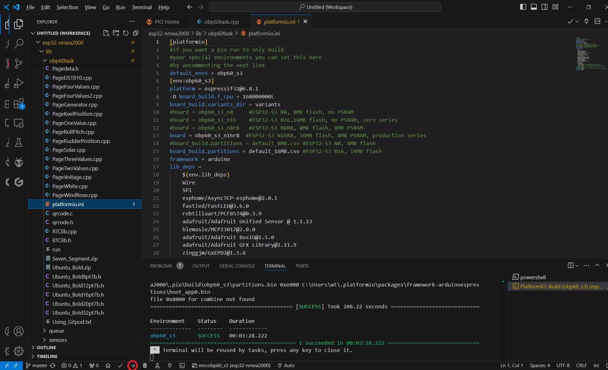

.. _Kompilieren und Download:

Kompilieren und Download
========================

Die Firmware zum OBP60 kann recht einfach an eigene Bedürfnisse angepasst werden. Als Programmier-Entwicklungsumgebung wird "PlatformIO" verwendet. Der Source-Code befindet sich zentral auf Github im Internet. Alle Software-Revisionen sind dort verfügbar. Es können bei Bedarf aktuelle oder ältere Versionen benutzt werden. Als Betriebssysteme werden Linux, Windows und Mac iOS unterstützt. Zum Kompilieren der Firmware gibt es zwei Möglichkeiten.

	* Verwendung von **Gitpod** (webbasiert in Cloud)
	* **Visual Studio Code** mit **PlatformIO** Plugin (lokal auf dem PC)
	
.. note::
	Die Arduino IDE wird nicht als Programmier-Entwicklungsumgebung verwendet, da der Source-Code sehr komplex ist und die Arduino IDE nicht über eine sinnvolle Querverweisfunktion verfügt. Notwendige Tool-Chains und Bibliotheken werden in PlatformIO in der richtigen Version hinzugelinkt und ermöglichen eine fehlerfreie Kompilierung.
	
Gitpod
------

Gitpod ist eine standartisierte Entwicklungsumgebung, die webbasiert ist und in der Cloud läuft. So ist es möglich, auf jedem Rechner, der über einen aktuellen Webbrowser verfügt, eine Code-Entwicklung durchzuführen ohne spezielle Installation von irgendwelchen Softwarebestandteilen. Zur Benutzung des Dienstes ist eine Anmeldung bei Github notwendig. Die Code-Entwicklungsumgebung in Anlehnung an PlatformIO befindet sich jederzeit in einem aktuellen Zustand. Abhängigkeiten zu externen Bibliotheken werden selbständig aufgelöst und integriert. Das System ist sofort benutzbar und ist besonders für Anfänger geeignet oder für kleine Änderungen, die unterwegs mal schnell durchgeführt werden sollen. Die Benutzung von Gitpod ist in der Free-Variante kostenfrei, unterliegt jedoch einigen Einschränkungen bezüglich der Nutzungszeit und bereitgestellten Rechnerhardware. Aktuell sind 50 Stunden Nutzungszeit pro Monat frei und vollkommen ausreichend für einfache Änderungen. Wer mehr Zeit benötigt oder schnellere Hardware einsetzen möchte, kann den kostenpflichtigen Service von Gitpod nutzen. Weitere Details findet man auf der `Webseite von Gitpod`_.

.. _Webseite von Gitpod: https://www.gitpod.io

**Der Workflow bei Gitpod sieht folgendermaßen aus:**

	1. OBP60-Github-Projekt in eigenes Github-Repository forken
	2. Gitpod-Link zum Projekt öffnen
	3. In Gitpod Entwicklungsumgebung und Hardware auswählen
	4. Start eines Containers mit der Entwicklungsumgebung und Download des Projektes aus dem eigenen Github-Repository
	5. Source-Code in der Entwicklungsumgebung ändern und kompilieren
	6. Download des Binary-Files
	7. Aktualisierung der Änderungen im eigenen Github-Repository

   
Github-Projekt forken
^^^^^^^^^^^^^^^^^^^^^

Als erstes wird das Original-Projekt zum OBP60 in das eigene private Repository geforkt. Ein Fork ist sozusagen eine Aufgabelung bzw. eine Abtrennung des Source-Codes in einen neuen Zweig. Durch einen Fork entsteht eine Kopie des Original-Projektes in Ihrem privaten Repository. So können Sie Änderungen am Code vornehmen und in ihrem Repository speichern. Der neu entstandene Code ist dann eine Erweiterung oder Modifikation des Original-Projektes.

.. hint::
	Nur mit einem Fork ist es möglich, eigene Code-Änderungen zu sichern.

.. image:: ../pics/Github_Fork.png
   :scale: 40%
Abb.: Fork erstellen

Melden Sie sich als erstes bei Github an und gehen dann in das `Original-Projekt zum OBP60`_ und drücken oben rechts auf die Schaltfläche **Fork**. Sie werden danach gefragt, ob sie der Quelle vertrauen und können dann einen neuen Projektnamen vergeben oder den originalen Projektnamen benutzen. Kopieren Sie sich danach den Link zu ihrem Github-Projekt aus der Browser-Zeile. Sie sollten dann einen ähnlichen Link haben wie diesen:

``https://github.com/MyAccountName/esp32-nmea2000-obp60/tree/master``

Der Part ``MyAccountName`` wird durch ihren eigenen Accountnamen ersetzt.

Gitpod-Link öffnen
^^^^^^^^^^^^^^^^^^

Das Gitpad-Projekt wird über den Repository-Namen des Github-Projekts aufgerufen:

``https://gitpod.io/#https://github.com/norbert-walter/esp32-nmea2000-obp60/tree/master``

.. hint::
	Wer eine ganz bestimmte Release-Version kompilieren möchte, benutzt anstatt ``master`` die Nummer der Release-Version wie z.B. ``20250304``. Branches und getaggte Versionen können auf die selbe Weise verwendet werden, indem der Banch- oder Tagname verwendet wird.

Sie gelangen dann auf die Startseite von Gitpod und müssen sich dort anmelden. Loggen Sie sich dort mit dem bereits vorhandenen Github-Account ein.

Abb.: Login bei Gitpod mit Github-Account

Gitpod-Settings
^^^^^^^^^^^^^^^

Danach können Sie die Default-Einstellungen übernehmen. Sie sind schon korrekt auf das Projekt eingestellt.

Abb.: Einstellungen für Gitpod

Container-Start
^^^^^^^^^^^^^^^

Nach der Bestätigung der Einstellungen für Gitpod wird ein neuer Docker-Container gestartet, danach werden alle notwendigen Softwarebestandteile automatisch in den Container geladen. Der Vorgang kann etwas Zeit beanspruchen. Am Ende sollten Sie einen fertigen Workplace vorfinden. Der Workplace erscheint im Look & Feel von Visual Studio Code, ist jedoch nicht mit ihm verwandt und in einigen Punkten verschieden. So gibt es z.B. kein IntelliSense und die Anzahl der Plugins ist deutlich geringer als beim Original. Zusätzlich fehlen die Buttons zum Kompilieren und zum Download auf die Zielhardware, sowie der serielle Monitor, wie man das von Visual Studio Code gewohnt ist. Über den Workplace lässt sich der Code verändern, kompilieren und das Binary herunterladen. Der Download des Binarys auf die Zielhardware muss mit externen Tools durchgeführt werden.

Abb.: Fertiger Workplace

Codeänderung und Kompilieren
^^^^^^^^^^^^^^^^^^^^^^^^^^^^

Der Code zum OBP60 befindet sich im Ordner: */ESP32-NMEA2000-OBP60/lib/obp60task* . Durch Editieren der Datei *platformio.ini* können einige Hardwareanpassungen zur Variante des ESP32-S3 und zum e-Paper-Display vorgenommen werden. 

Um den Code kompilieren zu können, müssen Sie folgende Befehle nacheinander in das Terminal-Fenster unten rechts einfügen. Sie können dazu die Copy & Paste Funktion benutzen.

	* ``cd /workspace/esp32-nmea2000-obp60``
	* ``bash /workspace/esp32-nmea2000-obp60/lib/obp60task/run_install_tools``
	* ``bash /workspace/esp32-nmea2000-obp60/lib/obp60task/run_obp60_s3``

Nach dem zweiten Befehl werden alle notwendigen Tool-Chains und Bibliotheken in den Workplace geladen. Dieser Vorgang kann einige Minuten dauern. Mit dem letzten Befehl beginnt der eigentliche Kompiliervorgang, der ebenfalls einiges an Zeit benötigt. Wenn Sie den Code später geändert haben und erneut kompilieren wollen, so benutzen Sie einfach den letzten Befehl erneut.

Abb.: Source-Code kompilieren

Wenn der Kompiliervorgang erfolgreich abgeschlossen ist, sollten Sie die folgende Meldung sehen: 

Abb.: Kompilierung beendet

Binary-Download
^^^^^^^^^^^^^^^

Der Binary-Code zur Firmware befindet sich nach dem Kompilieren im Verzeichnis:

	* */ESP32-NMEA2000-OBP60/.pio/build/obp60_s3* (für OBP60)

.. image:: ../pics/Gitpod_Download.png
   :scale: 40%
Abb.: Datei-Download

Dabei haben die Files folgende Bedeutung:

	* bootloader.bin - ESP32-S3 Bootloader für Firmware
	* partitions.bin - Partitionstabelle für den Flash Speicher
	* firmware.bin - Binärfile als Update (nur Firmware)
	* firmware.elf - ELF-File für Fehlerverfolgung
	* obp60_s3-all.bin - Binärfile mit allen Bestandteilen (Bootloader, Partitionstabelle, Firmware, Default-Settings)
	* **obp60_s3-dev20240820-all.bin** - wie obp60_s3-all.bin
	* **obp60_s3-dev20240820-update.bin** - Binärfile als Update (nur Firmware)
	
Je nachdem, ob man mit Default-Einstellungen starten oder mit den alten Einstellungen weiter arbeiten möchte, kann man eine der beiden fett hervorgehobenen Dateien herunter laden. Das geht am einfachsten, wenn man die entsprechende Datei im Dateibaum per Rechtsklick auswählt und sie dann über **Download** herunterlädt. Die **update-** Datei kann man später auf dem OBP60 über die Webseite :ref:`Update` hochladen und damit die Firmware aktualisieren. Die **all-** Datei muss über USB geflasht werden.

Source-Code Aktualisierung
^^^^^^^^^^^^^^^^^^^^^^^^^^

Wer die Source-Code-Änderungen in seinem Github-Repository speichern möchte, kann die Github-Funktionalität des Workplace nutzen. Auf der linken Seite befindet sich ein Icon mit einer Pfadverzweigung und einer kleinen blauen Zahl daran. Dieses Icon teilt dem Benutzer mit, wie viele Änderungen an Dateien durch die Source-Code-Änderungen vorgenommen worden sind. Mit einem Klick auf das Icon kann man eine Beschreibung für die Änderungen hinzufügen. Wenn man dem Dialog rechts am blauen Commit-Button folgt, kann man **Commit und Push** anklicken. Dadurch werden die Code-Änderungen in das eigene Github-Repository hochgeladen und gesichert. Wer später dort weitermachen möchte, wo er zuletzt aufgehört hat, kann der Vorgehensweise ab Punkt 2 folgen und den Gitpod-Link zu seinem Projekt öffnen.

.. hint::
	Nur mit einem Beschreibungstext zur Codeänderung können Sie die Änderungen committen und nach Github hochladen.

Abb.: Source Code auf Github sichern

Visual Studio Code / PlatformIO
-------------------------------

**Visual Studio Code** (VSC) ist eine weit verbreitete Software-Entwicklungsumgebung, die eine Vielzahl an Programmiersprachen unterstützt, und die es für verschiedene Betriebssysteme gibt. Die Entwicklungsumgebung läuft dabei auf einem lokalen PC. Zur Programmierung von Embedded Elektronik auf Mikrocontrollerbasis in C und C++ wurde das Plugin **PlatformIO** für Visual Studio Code geschaffen. Damit ist es unkompliziert möglich, eine Softwareentwicklung für Hardware durchzuführen. In einer umfangreichen Datenbank sind eine Vielzahl an Elektronik-Hardware-Boards aufgeführt. Passend zum Hardware-Board werden die notwendigen Tool-Chains und Software-Bibliotheken zu einem Projekt hinzugefügt, ohne dass man sich um Details kümmern muss.

.. hint::
Wer an einer Weiterentwicklung der Firmware zum OBP60 interessiert ist, sollte Visual Studio Code / PlatformIO benutzen. Visual Studio Code verfügt über Mechanismen, mit denen Softwareänderungen über Github eingepflegt und verfolgt werden können.
	
Wie man Visual Studio Code installiert und danach das Plugin PlatformIO einrichtet, ist in dieser `Anleitung`_ beschrieben. Sie finden im Internet auch weitere Beschreibungen zu diesem Thema.

.. _Anleitung: https://www.az-delivery.de/blogs/azdelivery-blog-fur-arduino-und-raspberry-pi/plattformio
	
**Der Workflow für Visual Studio Code sieht folgendermaßen aus:**

	1. OBP60-Github-Projekt in eigenes Github-Repository forken
	2. Projekt in Visual Studio Code importieren
	3. Source-Code in der Entwicklungsumgebung ändern und kompilieren
	4. Flashen der Firmware auf die Zielhardware
	5. Debuggen der Firmware über serielle USB-Verbindung
	6. Aktualisierung der Änderungen im eigenen Github-Repository
	
Github-Projekt forken
^^^^^^^^^^^^^^^^^^^^^

Als erstes wird das Original-Projekt zum OBP60 in das eigene private Repository geforkt. Ein Fork ist sozusagen eine Aufgabelung bzw. eine Abtrennung des Source-Codes in einen neuen Zweig. Durch einen Fork entsteht eine Kopie des Original-Projektes in ihrem privaten Repository. So können Sie Änderungen am Code vornehmen und in Ihrem Repository speichern. Der neu entstandene Code ist dann eine Erweiterung oder Modifikation des Original-Projektes.

.. hint::
	Nur mit einem Fork ist es möglich, eigene Code-Änderungen zu sichern.

.. image:: ../pics/Github_Fork.png
   :scale: 40%
Abb.: Fork erstellen

Melden Sie sich als erstes bei Github an, gehen dann in das `Original-Projekt zum OBP60`_ und drücken oben rechts auf die Schaltfläche **Fork**. Sie werden danach gefragt, ob Sie der Quelle vertrauen, und können dann einen neuen Projektnamen vergeben oder den originalen Projektnamen benutzen. Kopieren Sie sich danach den Link zu Ihrem Github-Projekt aus der Browser-Zeile. Sie sollten dann einen ähnlichen Link haben wie diesen:

.. _Original-Projekt zum OBP60: https://github.com/norbert-walter/esp32-nmea2000-obp60/tree/master

``https://github.com/MyAccountName/esp32-nmea2000-obp60``

Der Part ``MyAccountName`` wird durch Ihren eigenen Accountnamen ersetzt.

Projekt in VSC importieren
^^^^^^^^^^^^^^^^^^^^^^^^^^

Zu Beginn finden Sie einen leeren Workplace vor. Drücken Sie auf den Button **Clone Repository** und tragen in der oberen Zeile den Link zu Ihrem Github-Projekt ein. Danach klicken Sie auf die darunter liegende Zeile **Clone from Github**.

Abb.: Projekt clonen

Damit beginnt der Download des Projektes und im Workplace erscheint auf der linken Seite nach einiger Zeit das Projekt mit dem Dateibaum. Als letztes öffnet sich auf rechten Seite eine Datei mit dem Namen **platformio.ini**. Diese Datei schließen Sie oben rechts im Fenster über das Kreuz. Es handelt sich um die Konfigurationsdatei zum NMEA2000-Gateway, das wir in unserem Fall nicht benötigen.

Abb.: Konfigurationsdatei schließen

Gehen Sie dann in den Dateibaum und öffnen den Pfad: ``/esp32-nmea2000/lib/obp60task`` und öffnen dort die Datei **platformio.ini**, die zum OBP60-Projekt gehört. Ändern Sie in der Datei die serielle Schnittstelle entsprechend zum Port, an dem Sie das OBP60 angeschlossen haben. Die Schnittstellenbezeichnungen unter Windows und Linux sind dabei unterschiedlich.

	* Windows: COMx
	* Linux: /dev/ttyACM0
	
.. note::
	Für Linux und Win10/11 sind entsprechende USB-Treiber im Betriebssystem integriert. Für die älteren Win7/8-Versionen benötigen Sie `zusätzliche Treiber`_, um die USB-Schnittstelle Ihres Rechners benutzen zu können.
	
.. _zusätzliche Treiber: https://github.com/kutukvpavel/Esp32-Win7-VCP-drivers

Abb.: Konfigurationsdatei schließen und seriellen Port einstellen

Wählen Sie danach die zu benutzende Hardware-Umgebung aus, indem Sie auf die untere Zeile klicken. Es öffnet sich dann oben ein Fenster, in dem Sie die Einstellung **env:obp60_s3** auswählen. Damit wird sichergestellt, dass die Firmware für die Hardware OBP60 erstellt wird.

Abb.: Hardware-Umgebung auswählen

Codeänderung und Kompilieren
^^^^^^^^^^^^^^^^^^^^^^^^^^^^

Wenn Sie Ihre Code-Änderungen abgeschlossen haben, können Sie den Kompiliervorgang am Symbol mit dem Haken in der untersten Zeile aktivieren. Vergewissern Sie sich vorher, dass die korrekte Hardware-Umgebung **env:obp60_s3(esp32-nmea2000)** ausgewählt worden ist. Der Kompiliervorgang benötigt einiges an Zeit. Am Ende sollten Sie eine Mitteilung im Terminal-Fenster erhalten, die Sie über das Resultat informiert.

Abb.: Kompilierung

Der Binary-Code zur Firmware befindet sich nach dem Kompilieren im Verzeichnis: */esp32-nmea2000-obp60/.pio/build/obp32_s3*

Dabei haben die Dateien folgende Bedeutung:

	* bootloader.bin - ESP32-S3 Bootloader für Firmware
	* partitions.bin - Partitionstabelle für den Flash-Speicher
	* firmware.bin - Binärfile als Update (nur Firmware)
	* firmware.elf - ELF-File für Fehlerverfolgung
	* obp60_s3-all.bin - Binärfile mit allen Bestandteilen (Bootloader, Partitionstabelle, Firmware, Default-Settings)
	* **obp60_s3-dev20240820-all.bin** - wie obp60_s3-all.bin
	* **obp60_s3-dev20240820-update.bin** - Binärfile als Update (nur Firmware)

Flashen der Firmware
^^^^^^^^^^^^^^^^^^^^

Wenn Sie die Firmware auf das OBP60 flashen möchten, dann verbinden Sie das OBP60 mit dem USB-Anschluss Ihres PCs und drücken danach das Symbol mit dem Pfeil in der untersten Zeile. Zuerst wird die Firmware kompiliert und anschließend auf das OBP60 übertragen. Im Terminalfenster sehen Sie den Ablauf der einzelnen Schritte.

Abb.: Flashen der Firmware

.. hint::
	Falls keine Verbindung mit dem OBP60 über die USB-Schnittstelle zustande kommt, können Sie das OBP60 manuell in den Flash-Modus versetzen. Trennen Sie zunächst die USB-Verbindung. Öffnen Sie danach die hintere Gehäuseabdeckung des OBP60 und stellen Sie mit der Drahtbrücke eine Verbindung von ``GND`` (CN2) zum ``Pin 27`` (ESP32-S3) her. Dann verbinden Sie das OBP60 mit Ihrem PC über das USB-Verbindungskabel. Sobald die USB-Schnittstelle erkannt wird, erfolgt eine Tonausgabe auf dem PC. Sie können dann die Drahtbrücke zwischen ``GND`` und ``Pin 27`` trennen. Der ESP32-S3 befindet sich jetzt im Flash-Modus. Danach starten Sie einen erneuten Flash-Vorgang über das Symbol mit dem Pfeil, wie oben gezeigt.

.. image:: ../pics/Bridge_GND-Pin27.png
   :scale: 40%
Abb.: Brücke zwischen ``GND`` und ``Pin 27``

Debuggen der Firmware
^^^^^^^^^^^^^^^^^^^^^

Eine einfache Möglichkeit zur Fehlersuche besteht darin, dass man Debugging-Informationen über die serielle USB-Schnittstelle ausgibt, die man auf dem PC mit einem Terminalprogramm empfangen kann. In der Firmware zum OBP60 sind Funktionen implementiert, mit denen man Debugging-Ausgaben erzeugen kann. In Visual Studio Code ist ein serielles Terminal integriert. Sie können es über das Symbol mit dem Stecker in der untersten Zeile starten. Die Ausgaben erfolgen dann unten rechts im Bereich "Terminal". Wenn Sie das Logging beenden wollen, klicken Sie rechts auf den aktuell laufenden Task und beenden ihn, indem Sie auf das Symbol mit dem Papierkorb drücken.

.. note::
	Beachten Sie, dass die Schnittstellengeschwindigkeit standardmäßig auf **115200 Bd 8N1** eingestellt ist. Die Geschwindigkeit der seriellen USB-Schnittstelle lässt sich bei Bedarf in platformio.ini unter **monitor_speed** verändern.

Abb.: Debugging über Serial Monitor

Source-Code Aktualisierung
^^^^^^^^^^^^^^^^^^^^^^^^^^

Wenn man die Source-Code-Änderungen in seinem Github-Repository speichern möchte, kann man die Github-Funktionalität des Workplace nutzen. Auf der linken Seite befindet sich ein Icon mit einer Pfadverzweigung und einer kleinen blauen Zahl daran. Dieses Icon teilt dem Benutzer mit, wie viele Änderungen an Dateien durch die Source-Code-Änderungen vorgenommen worden sind. Mit einem Klick auf das Icon kann man eine Beschreibung für die Änderungen hinzufügen. Wenn man dem Dialog rechts am blauen Commit-Button folgt, kann man **Commit und Push** anklicken. Dadurch werden die Code-Änderungen in das eigene Github-Repository hochgeladen und gesichert.

.. hint::
	Nur mit einem Beschreibungstext zur Codeänderung können Sie die Änderungen commiten und nach Github hochladen.

Abb.: Source Code auf Github sichern

Wer später dort weitermachen möchte, wo er zuletzt aufgehört hat, kann sich den letzten Stand auf Github in seinen Workplace herunterladen und aktualisieren. Dazu klicken Sie links auf das Pfadsymbol und dann oben im selben Fenster auf die kleinen 3 Punkte. Über **Pull** können Sie ihr Projekt aktualisieren.

.. hint::
	Es ist empfehlenswert, vor Beginn jeder Codeänderung einen **Pull** durchzuführen, um das Projekt auf den aktuellen Stand zu setzen, denn ein nachträglich ausgeführtes **Pull** würde den bereits veränderten Code überschreiben.
	

Abb.: Source Code auf Github sichern
