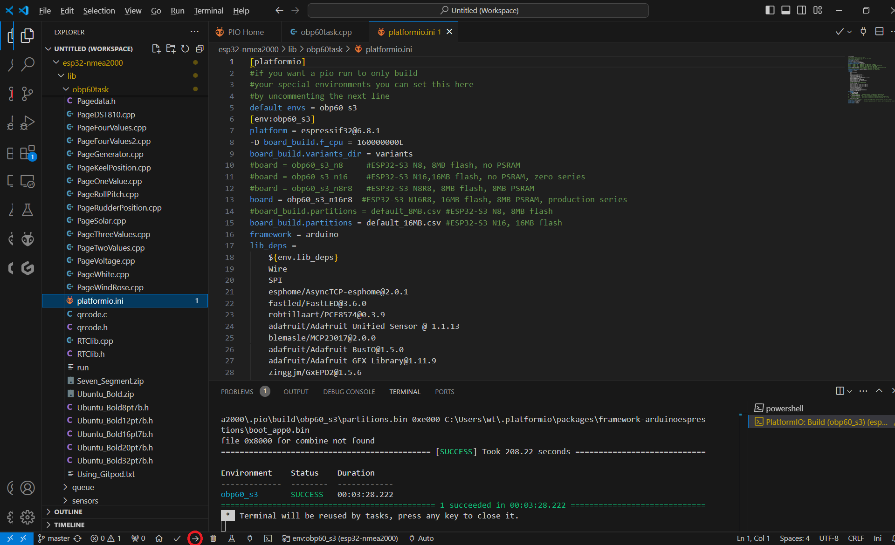

Programmierumgebung
===================

Als Programmierumgebung für das OBP40 wird das kostenlose Entwicklungstool **Visual Studio Code** in Verbindung mit **PlatformIO** verwendet. Diese Kombination bietet Vorteile gegenüber der Arduino-IDE, da projektbezogen die verwendete Hardware und die Bibliotheken in den richtigen Versionen hinzugelinkt sind und Sie sich um diese Dinge nicht kümmern müssen. Zusätzlich verfügt Visual Studio Code über eine mächtige Querverweisliste, so dass Sie den Code besser verstehen und nachvollziehen können. Intellisense unterstützt Sie bei der korrekten Verwendung von Funktionsaufrufen und Variablen. Über Github können Sie von Visual Studio Code aus auf den aktuellsten Firmware-Code zugreifen und sind damit immer auf dem aktuellsten Stand.

Abb.: Visual Studio Code

Visual Studio Code mit PlatformIO ist für alle gängigen Betriebssysteme verfügbar wie:

* Linux
* Windows
* Mac OS

Wer an der Weiterentwicklung des Firmware-Codes interessiert ist, sollte Visual Studio Code mit PlatformIO in Verbindung mit Github nutzen. So kann eine breite Community an der Weiterentwicklung mitwirken und den Firmware-Code erweitern und verbessern. Aufgetretene Fehler und Wünsche der Community verwalten wir über Issues im Trackingsystem von Github. Im Segeln-Forum gibt es eine große Community, die an der Weiterentwicklung mitarbeitet und auf Support-Fragen antworten kann.

* `Visual Studio Code`_
	* **Notwendige Erweiterungen**
	* PlatformIO
	* C/C++
* `Github-Projekt-Repository`_
* `Issues Tracking System`_
* `Community Forum`_

.. _Visual Studio Code: https://code.visualstudio.com/download
.. _Github-Projekt-Repository: https://github.com/norbert-walter/esp32-nmea2000-obp60
.. _Issues Tracking System: https://github.com/norbert-walter/esp32-nmea2000-obp60/issues
.. _Community Forum: https://www.segeln-forum.de/board/195-open-boat-projects-org/

Wie man Visual Studio Code installiert und benutzt ist im Kapitel :ref:`Visual Studio Code / PlatformIO` beschrieben.

Wer kleine Änderungen am Code unterwegs unkompliziert vornehmen möchte ohne eine aufwändige Installation von Visual Studio Code und PlatformIO durchzuführen, kann Gitpod benutzen. Gitpod ist vollständig webbasiert. Sie benötigen nur einen aktuellen Webbrowser und können sofort mit der Programmierung beginnen. Der Workplace von Gitpod orientiert sich an Visual Studio Code und enthält alle vorinstallierten Komponenten die Sie zur Softwareentwicklung benötigen. Gitpod eignet sich dahzer hervorragend für Anfänger. Im Kapitel :ref:`Gitpod` ist die Benutzung beschrieben.