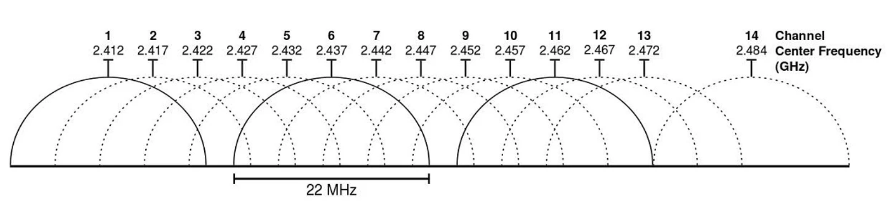

Sicherheitshinweise
===================

Allgemeine Hinweise
-------------------

Die auf dieser Webseite veröffentlichten Informationen sind im Rahmen eines Hobbyprojektes entstanden. Das Open-Source-Projekt ist als Machbarkeitsstudie zu verstehen, die zeigen soll, wie mit begrenzten Möglichkeiten private Projekte umgesetzt werden können. Die Qualität hinsichtlich Funktionalität, Sicherheit und Dokumentation ist nicht mit kommerziellen Produkten vergleichbar. Die Benutzung der Open-Source-Software und Hardware erfolgt auf eigene Gefahr unter Ausschluss von Haftungsansprüchen.

.. danger::
	Jedem Interessierten sollte klar sein, dass die Nutzung des hier vorgestellten Projektes auf eigene Gefahr erfolgt und mit Fehlern und Störungen zu rechnen ist, die schwerwiegende Konsequenzen haben können. Führen Sie vor dem Einsatz des OBP60 eine Risikoanalyse durch und treffen geeignete Maßnahmen, um Schäden und Gefährdung anderer Personen zu vermeiden.

.. note::
	**NMEA2000** (TM), **NMEA0183** (TM), **SeaTalk** (TM), **SeaSmart** (TM) sind eingetragene Marken der jeweiligen Markeninhaber. Die Namen werden auf dieser Seite als Synonym für diese Protokoll-Typen benutzt. Wenn in den Beschreibungen darauf Bezug genommen wird, so sind Open-Source-Implementierungen damit gemeint, die nicht in allen Punkten den Qualitätsanforderungen und Spezifikationen der jeweiligen Markeninhaber entsprechen. Die Software und Hardware versteht sich als experimentell zur Wissensgewinnung und sollte nicht mit sicherheitskritischen Systemen wie z.B. einem Autopiloten verbunden und betrieben werden. Es kann keine Garantie für die korrekte Implementierung der Protokolle und deren Funktionssicherheit übernommen werden.

.. danger::
	Die Integration von Open-Source-Implementierungen in zertifizierte Bussysteme kann zu Fehlern, Störungen und Totalausfällen führen.

Bei auftretenden Problemen oder Mängeln bitte wir Sie, uns eine Information über das `Kontaktformular`_ zukommen zu lassen. So können wir auf Qualitäts- und Sicherheitsprobleme eingehen und für Abhilfe sorgen.

.. _Kontaktformular: https://open-boat-projects.org/de/kontakt/

Sicherheit im WiFi-Netzwerk
---------------------------	

Sie sollten das OBP60 nur mit vertrauenswürdigen WiFi-Netzwerken verbinden. Es gibt im Gerät nur einen sehr begrenzten Schutz gegen Netzwerk-Sniffing oder Denial-of-Service-Angriffe. Solange Sie das eigene autarke WiFi-Netz des OBP60 nutzen, können fremde Personen nicht ohne weiteres auf das WiFi-Netz des OBP60 zugreifen. Auf diese Weise läuft die Datenübertragung in Ihrem eigenen WiFi-Netzwerk geschützt. Verbinden Sie das Gerät niemals ohne eine Firewall direkt mit dem Internet, und vermeiden Sie direkte Verbindungen zu offenen Hafen-WLANs. Dadurch können auch fremde Personen auf Ihre Geräte im Netzwerk zugreifen.

.. note::
	Sie können die Sicherheit erhöhen, indem Sie einen separaten WiFi- oder LTE-Router in Ihrem Boot verwenden. Die Router können so eingerichtet werden, dass Sie ein eigenes WiFi-Netz aufspannen, mit dem alle Geräte an Bord verbunden sind. Gängige mobile Router verfügen in der Regel über eine bereits eingeschaltete Firewall, über die Sie Ihr eigenes WiFi-Netz mit dem Internet verbinden können. Die Firewall verhindert fremden Zugriff von außen auf Ihre Geräte. So haben alle Geräte in Ihrem Netz einen gemeinsamen Internet-Zugriff und sind zugleich ausreichend geschützt.

Die Verbindungsqualität von WiFi-Netzwerken hängt maßgeblich von der Auslastung der Funkkanäle ab, die in Ihrer Umgebung aktuell benutzt werden, denn Ihr Gerät teilt sich die selben Funkkanälen mit anderen Teilnehmern anderer WiFi-Netze. Das OBP60 nutzt die Funkkanäle des 2.4 GHz-Frequenzbandes.

.. warning::
	Bei hoher Auslastung wie z.B. in Häfen kann die Verbindungsqualität des eigenen WiFi-Netzwerks dadurch beeinträchtigt sein. Sie müssen dann mit Verzögerungen bei der Datenübertragung rechnen, insbesondere, wenn Sie TCP-Datenverbindungen zum oder vom OBP60 nutzen. Stellen Sie aber auf alle Fälle sicher, dass in solchen Situationen die Bootsführung nicht beeinträchtigt wird.

.. hint::
	Verwenden Sie bei hoher Kanalauslastung Kanäle mit geringer Auslastung. Die Kanäle 1, 13 und 14 haben nur einen Nachbarkanal und sind deutlich robuster gegen hohe Auslastung als die anderen Kanäle. Am besten eignet sich der Kanal 13, da er seltener benutzt wird. In den USA kann auch der Kanal 14 verwendet werden. Moderne mobile Router bieten häufig eine Automatik in ihrer Konfiguration an, die die Kanalauswahl optimieren hilft.

Bei Änderungen der Konfiguration des OBP60 werden Sie grundsätzlich nach dem Admin-Passwort gefragt. Die Übertragung des Passwortes erfolgt dabei immer verschlüsselt. Wenn Sie jedoch das Passwort für den WLAN-Zugangspunkt oder das WiFi-Client-Passwort ändern, wird es im Klartext gesendet. Wenn Sie das ``Remember me`` für das Admin-Passwort aktivieren, wird es im Klartext in Ihrem Browser gespeichert. Um es von dort zu entfernen, verwenden Sie ``Forget Password``.
 

